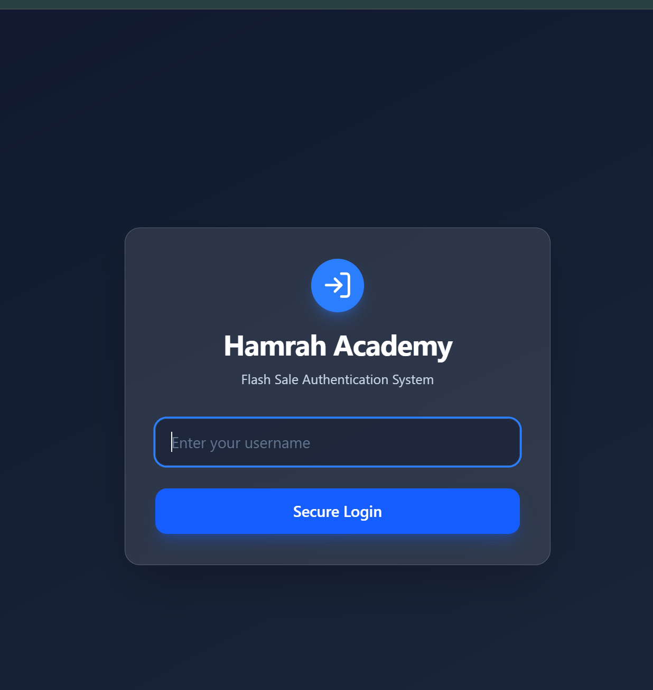
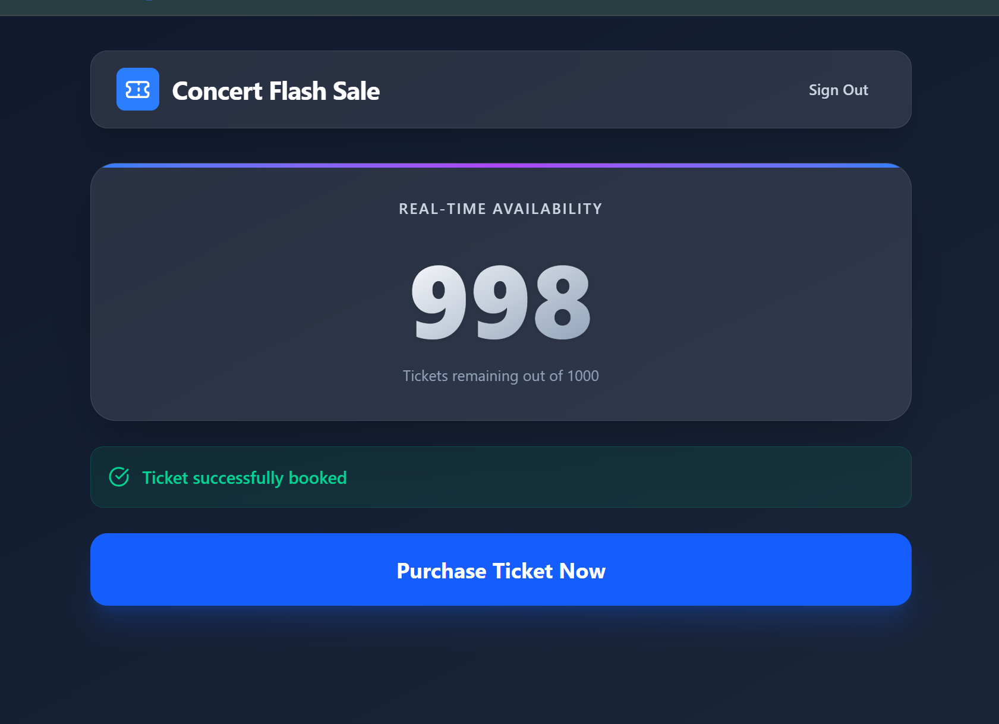
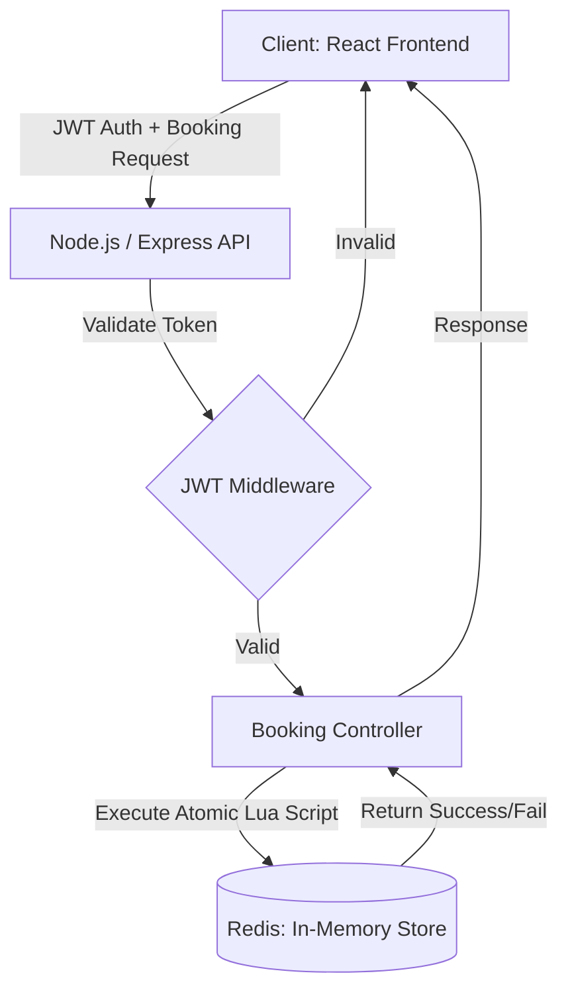

# 🎟️ Concert Flash Sale System | Hamrah Academy Assessment


## 📌 Overview
This project is a high-concurrency ticket booking system built for the **Hamrah Academy Assessment**. The core challenge is to reliably open the sale of exactly 1,000 concert tickets to tens of thousands of concurrent users without any system degradation or **overselling** under heavy load.

## 📸 User Interface
*(Below is the modern Glassmorphism UI implemented exclusively with React)*




## 🏗️ High-level Architecture
The architecture is designed to handle extreme concurrency using an In-Memory data store for atomic operations.



## 🧠 Design Patterns & Technical Decisions

* **Atomic Transactions (Lua Scripting via Redis):** To prevent the primary issue of **Overselling**, relying on relational database row-locking under heavy load creates severe bottlenecks. Instead, we utilized **Redis** with a custom Lua script. Redis executes Lua scripts atomically, ensuring that even if 15,000 requests hit the server at the exact same millisecond, the inventory will decrement safely and halt exactly at 0.
* **Stateless Authentication:** Implemented JWT (JSON Web Tokens) to authenticate users. This avoids database lookups for session validation, reducing latency during the flash sale rush.
* **Modern UI (React + Tailwind v4):** The frontend is built exclusively with React. We adopted a modern, glass-like aesthetic (Glassmorphism) using Tailwind CSS to provide a visually engaging and responsive experience.

## 🚀 How to Run the Project

### Prerequisites

* Node.js (v18+)
* Docker Desktop (for Redis container)

### 1. Database Setup

Run the Redis container in the background from the root directory:

```bash
docker-compose up -d

```

### 2. Backend Setup

Open a terminal in the `backend` folder:

```bash
cd backend
npm install
npx nodemon src/index.ts

```

*(The server will start on `http://localhost:5000`)*

### 3. Frontend Setup

Open a new terminal in the `frontend` folder:

```bash
cd frontend
npm install
npm run dev

```

*(The UI will be accessible at `http://localhost:5173`)*

### 4. ⚡ Running the Load Test

To prove the system's resilience against overselling, we have included a high-concurrency load-testing script that fires 1,500 simultaneous requests at the API. Ensure the backend and database are running before executing the test.

```bash
cd backend
npx ts-node src/loadTest.ts
